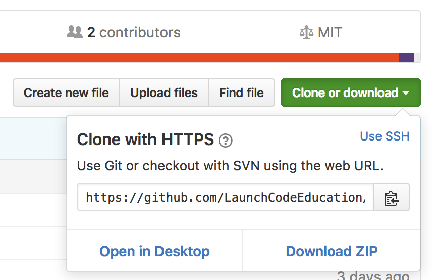
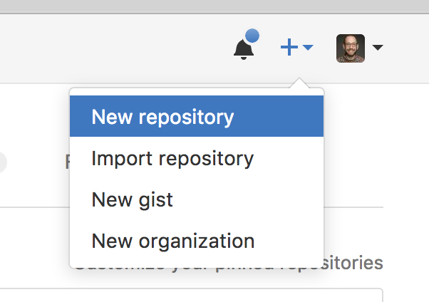
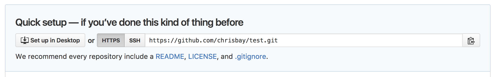
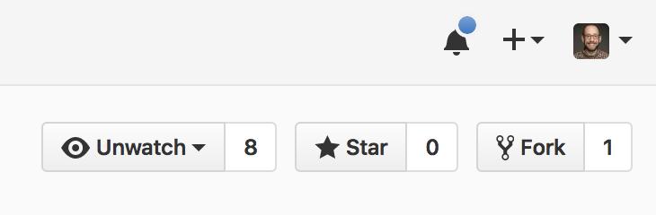
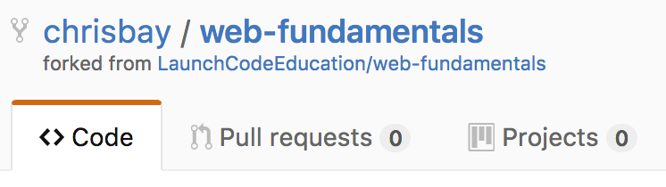

# Git Basics

This cheatsheet covers basic commands for creating and working with local and remote Git repositories.

## Quick Reference: Basic Workflow

For most situations, you'll want to use the following basic workflow for git project:

1. Make changes to your code
2. Check status: `$ git status`
3. Stage changes: `$ git add .`
4. Commit changes: `$ git commit -m "Added feature X"`
5. (If working with a remote repository) Push changes: `$ git push origin master`

The details of these commands, along with the basics of how to get repositories set up, are detailed below.

This sheet does not cover intermediate topics like branching, fetching, and merging.

## Creating a Repository

How you create your repository depends on whether or not you're starting with an new, empty project or with a pre-existing project from a remote location like GitHub.

### Creating a Local Repository: `git init`

To create an empty local repository for a new project, run the following command from the project directory:
```nohighlight
$ git init
Initialized empty Git repository in /Users/adalovelace/lc101/new-project/.git/
```

### Cloning a Remote Repository from GitHub: `git clone`

To create a local version of a pre-existing project on GitHub, visit that project's page and copy the **Clone or download** URL.



> *NOTE:* The project URL is **not** the same as the URL in your browser's address bar, although they are similar. Do not copy the URL from the address bar. Always look for the **Clone or download** button to obtain the project URL.

Then at a terminal:
```nohighlight
$ git clone PROJECT_URL
Cloning into 'existing-project'...
remote: Counting objects: 13, done.
remote: Total 13 (delta 0), reused 0 (delta 0), pack-reused 13
Unpacking objects: 100% (13/13), done.
```

## Check Repository Status: `git status`

The `status` command of `git` is one of the most commonly-used and most essential. It gives you vital information about the current state of your local repository, including which branch you are currently working on, changes between your local repo and a remote repo, which files are staged for commit, and which changed or new files are not stage or tracked.

**Use `git status` frequently**, especially before getting ready to carry out a new operation on your repository. Here are a few examples of output:

**No outstanding changes, not connected to a remote:**
```nohighlight
$ git status
On branch master
nothing to commit, working tree clean
```

**No outstanding changes, connected to a remote:**
```nohighlight
$ git status
On branch master
Your branch is up-to-date with 'origin/master'.
nothing to commit, working tree clean
```

**Outstanding changes, connected to a remote:**
```nohighlight
$ git status
On branch master
Your branch is up-to-date with 'origin/master'.
Changes not staged for commit:
  (use "git add <file>..." to update what will be committed)
  (use "git checkout -- <file>..." to discard changes in working directory)

	modified:   README.md

Untracked files:
  (use "git add <file>..." to include in what will be committed)

	.gitignore
	git-basics/
```

## Staging Files for Commit: `git add`

Git keeps track of changes to files within your project, but only if you tell it to. To commit changes to new or existing files, you must first *stage* those files using git's `add` command.

If you have created a new file, but not staged it, `git status` will show the following:
```nohighlight
$ git status
On branch master
Untracked files:
  (use "git add <file>..." to include in what will be committed)

	newfile.py

nothing added to commit but untracked files present (use "git add" to track)
```

To stage the new file for commit:
```nohighlight
$ git add newfile.py
```

You will see an updated status for the file after staging it:
```nohighlight
On branch master
Changes to be committed:
  (use "git reset HEAD <file>..." to unstage)

	new file:   newfile.py

```

If you modify a file that has already been added to the repository, it's status will be:
```nohighlight
$ git status
On branch master
Changes not staged for commit:
  (use "git add <file>..." to update what will be committed)
  (use "git checkout -- <file>..." to discard changes in working directory)

	modified:   new.txt

no changes added to commit (use "git add" and/or "git commit -a")
```

Staging changes for such a file uses the same syntax as for a new file: `$ git add new.txt`

If you have lots of changes or new files to add, you can add them all at once using:
```nohighlight
$ git add .
```

> *NOTE:* Before using `git add .` make sure you know what you'll be staging! Run `git status` first. This will save you lots of headaches, and keep you from staging and committing unwanted changes.

## Committing Files: `git commit`

To commit all staged changes to your *local* repository, use git's `commit` command.
```nohighlight
$ git commit -m "Add amazing new feature"
[master de0d4b6] Add amazing new feature
 2 files changed, 2 insertions(+)
```

 The `-m` flag adds a descriptive message, which will help you quickly tell which changes were included in the commit later on. Use concise, descriptive messages! And don't forget to surround your commit message with quotes.

## Pushing Files to a Remote Repository: `git push`

To push all committed changes from your local repository to a remote repository (e.g. a repository on GitHub), use git's `push` command:

```nohighlight
$ git push origin master
Counting objects: 4, done.
Delta compression using up to 4 threads.
Compressing objects: 100% (4/4), done.
Writing objects: 100% (4/4), 934 bytes | 0 bytes/s, done.
Total 4 (delta 2), reused 0 (delta 0)
remote: Resolving deltas: 100% (2/2), completed with 2 local objects.
To github.com:LaunchCodeEducation/cheatsheets.git
   73f1872..2926328  master -> master
```

This command can be verbalized as, "Hey, git, push all of my commits to the master branch of the remote repository named 'origin'." This sheet doesn't cover branch usages, and for most commands here referring to a branch is unecessary, but to use `push` it is required.

> *NOTE:* Only changes that have been committed will be pushed. If you push changes to GitHub and you don't see them reflected in your remote project, check that you actually commited them.

## Working With Remote Repositories

Working with only a local repository is fine for some purposes, but you'll quickly find it better to connect your local repository to a remote repository. Using a remote repository allows you to:
- easily back up your project
- collaborate with other programmers
- work on the same project on different computers
- make your code accessible to others (to show to a potential employer, for instance)

At LaunchCode we'll always use [GitHub](https://github.com/) to store our remote repositories, but there are other applications for hosting remote repositories, including [GitLab](https://about.gitlab.com/) and [Bitbucket](https://bitbucket.org/).

### Creating a Remote Repo at GitHub

When signed in, you can create a new remote repository by clicking on the plus icon near your profile, at the top right.



Fill out the resulting form and submit to create a new repository. You now need to connect your local repository to your remote. First, copy the remote repository URL from the the screen you're on:



If you chose to initialize your repository with a `README` or `.gitignore` file, your screen will look slightly different. Copy the project URL using the **Clone or download** button on your project's page (see screenshot and note above).

Then, from the terminal, in your project directory:
```nohighlight
$ git remote add origin PROJECT_URL
```

This command can be verbalized as, "Hey, git, add a new remote repository connection named 'origin', which lives on the web at PROJECT_URL". The first portion of this command -- `git remote add` -- must always be the same. The `origin` piece is a name that we've chosen to refer to our remote repository. If you have multiple remotes, or want to choose a different name, you may do so. However, you must use this name when pushing/pulling code to/from the remote repository. `origin` is a widely-used default name when you only have one remote (as will almost always be the case in LaunchCode classes).

### Forking a Repository at GitHub

A scenario that will occur from time-to-time in LaunchCode courses, and which occurs quite a lot for developers in general, is that of wanting to copy another developer's project and modify it. This process is known as "forking a repository" since if you view a project's history as a timeline, copying it effectively creates a "fork" in that history.

To fork another developer's repository, visit the project at GitHub and hit the Fork button:



This will create a *copy* of the remote repository under your own GitHub profile. You will have a snapshot of the other developer's repository, taken at the moment you hit the Fork button.

From your own profile page, you will see the forked repository listed alongside your other repositories. To work on the code, clone the repository to your computer using the method at the top of this cheatsheet.

Forked repositories can easily be identified by the reference to the original project under the project name on your profile.



## Helpful Git Resources

[Pro Git Book](https://git-scm.com/book/en/v2) - A reference book covering Git in depth.

[Flight Rules for Git](https://github.com/k88hudson/git-flight-rules) - A "How to" guide for git

[Interactive GitHub Sandbox](https://try.github.io) - A place to practice git without fear of messing anything up.

[Connecting to GitHub with SSH](https://help.github.com/articles/connecting-to-github-with-ssh/)

